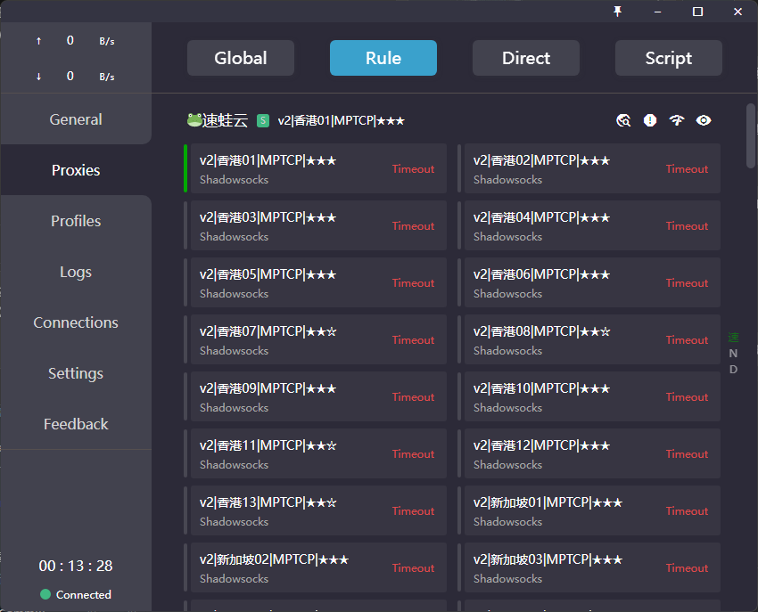

# 从2018到现在：我的翻墙十年，和我为什么决定自己做机场

> 这篇不算科普，更像是一篇个人记录。写下来一是给自己留个纪念，二是想让正在为选机场发愁的人知道：你踩过的坑，我基本都踩过一遍。
>
> ## 2018年，第一次接触"翻墙"
>
> 我第一次接触科学上网是在2018年。那会儿完全是个小白，靠着论坛里的推荐帖一家一家试。印象最深的是在某个论坛看到一堆人推荐Tempest，说是"稳定好用老牌子"，就冲了一单；后来又在YouTube刷视频的时候刷到速蛙云的广告，做得挺唬人，也冲了。除此之外还陆陆续续用过"云云云"这种听名字就很像那个年代批量注册域名的大厂，加上一堆叫不上名字的小机场，前前后后加起来试过的服务应该有十几家。
>
> 那几年整个行业给我的感觉就是"来得快，去得也快"。这些机场，不管大厂小厂，后来大部分都收钱跑路了——有的是悄无声息地把官网和售后一起关掉，有的是先发个"服务器迁移"的公告，然后就再也没有下文。
>
> ## 为什么这些机场会跑路？我自己复盘的几个原因
>
> 用了这么多年，加上后来自己也入了行，回头看这些机场跑路，原因其实能分成两类。
>
> **大厂的问题主要出在技术跟不上迭代，还有上游供应链本身也不稳。** 早几年靠的还是比较基础的协议，IP被墙的频率很高，几乎是"用一批换一批"，节点组需要持续不断地买新IP、切新线路来维持可用性。这本身就是一笔不小的长期投入，而后来协议这块的技术迭代很快，从早期的方案一路演进到现在的Hysteria2、REALITY这些，不少当年靠资本堆起来的大厂，团队本身的技术底子没跟上迭代节奏，改造成本越滚越大，最后要么technical debt压垮自己，要么干脆放弃维护，卷钱走人。
>
> 除了机场自己的问题，上游供应链的不稳定也是很关键的一环。我印象比较深的是在"电玩科技AK"这个圈子里听说过一个叫"花卷"的上游线路供应商，当时不少VPN厂商的节点都是从他那边拿的线路。后来听说这家供应商突然对一批VPN厂商集中"拔线"，说断就断，完全没有缓冲期。对下游机场来说，这种事一旦发生就是灭顶之灾——自己节点说没就没，用户那边却看不到、也理解不了背后的供应链问题，只会觉得"这家又跑路了"。这也是我后来决定尽量掌握核心线路资源、不把身家性命全押在单一上游身上的原因之一。
>
> **小机场的问题则更直接——纯粹是"人不够"。** 小团队通常就一两个人在维护，服务器出问题没人及时处理，经常一断就是好几天；客服基本等于摆设，工单发过去石沉大海；没有资金和精力去做协议升级和节点扩容，慢慢地节点越来越不能用，用户流失，最后自己也懒得再续费服务器，不了了之地消失。
>
> 速蛙云跑路那次我印象特别深。当时它还有个官方Telegram群，跑路之后群里瞬间就炸了，一堆被坑的用户后来干脆自己拉了个"机场难民营"的TG群，天天在里面吐槽、互相安慰、交流哪家还能用——那种一群陌生人因为同一次被坑而抱团取暖的场面，到现在想起来都历历在目。
>
> 还有个小细节现在想起来挺有意思：速蛙云当年给客户解锁Netflix会员资格的方式，是让用户在浏览器里装一个证书，靠这个证书来获取会员权限。这种做法现在回头看也算是那个年代机场圈子里挺典型的一种"土办法"。
>
> 到今天为止，我本地还留着当年速蛙云的Clash配置文件，一直没删，就当是个纪念——毕竟那是我入门科学上网的起点。
>
> 
> *这是我电脑里当年速蛙云订阅的截图，现在所有节点都已经失效*
>
> 原始的订阅配置文件我也一直留着，放进了仓库里：[2022-suwayun-config-memento.yml](../resources/2022-suwayun-config-memento.yml)
>
> ## 技术上摸爬滚打的那几年
>
> 除了看别人踩坑，我自己也交了不少技术上的学费。最开始的时候，我还专门租过电信的服务器用来做中转，那段时间延迟直接降到最低，体验特别好。但好景不长，后面电信的服务器说拔线就拔线，完全没有征兆，把我打了个措手不及。那时候用的还是vmess协议，后来陆陆续续又去研究了AnyTLS、Hysteria2、VLESS+REALITY这些协议，最疯狂的时候能对着电脑连坐三天两夜不睡觉，就为了搞明白怎么把协议正确部署到服务器上、了解它们各自的握手原理、怎么调才能让速度最快、怎么才能避免晚高峰延迟飙升的问题。
>
> 后来也认真考虑过直连方案——直连确实"香"，延迟低、链路简单，但现实是服务器IP隔三差五就被墙，一被墙就得联系上游换IP，治标不治本。中转的BGP方案我也琢磨过不少，甚至想过用亚马逊云的服务器做中转、用软银（SoftBank）的服务器做中转。折腾了一圈下来，最后还是选择了中转方案，说到底就是图一个"稳定"两个字。
>
> ## 后来我为什么决定自己做机场
>
> 真正让我下决心自己做的，其实不是因为踩坑踩多了赌气，而是因为我自己在做外贸生意的过程中，被"机场跑路"这件事反复坑到忍无可忍。
>
> 做外贸离不开翻墙——找客户、收发邮件、用各种海外工具，一天都离不开稳定的网络。但这几年我眼睁睁看着好几家机场说没就没：前几天刚续完费，过几天节点就集体超时，官网直接打不开，连GitHub上的issue区都一起关了，想申诉都找不到门路。钱打了水漂是小事，真正麻烦的是业务被迫中断，跟国外客户对接的节奏全被打乱。
>
> 我本身就喜欢折腾技术，之前也帮广东这边几家外贸公司搭建过节点，帮他们把网络环境从"三天两头掉线"改造成稳定可用，得到了不少企业客户的认可。既然自己有这个技术能力，又长期被同一个问题反复折磨，那不如干脆自己下场做——至少对我自己的外贸业务来说，节点稳不稳、公司还在不在，我说了算。
>
> 这就是"速度无限"这个机场最初的由来：不是一时兴起，而是被行业里反复上演的跑路潮逼出来的一个选择。
> 
