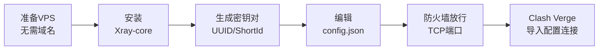

# VLESS+REALITY从零搭建到Clash Verge连接：一份能直接跑通的实战教程

> 同步发布于 [速度无限VPN官方博客](https://main.suduwuxian.top/vless-reality%e4%bb%8e%e9%9b%b6%e6%90%ad%e5%bb%ba%e5%88%b0clash-verge%e8%bf%9e%e6%8e%a5%e6%95%99%e7%a8%8b/)

> 如果说Hysteria2的卖点是"抗丢包、速度快"，那VLESS+REALITY的卖点就是"伪装得像真的"——它不需要自己的域名和证书，直接借用一个真实网站的TLS握手做伪装，主动探测的人很难把它和访问那个真实网站区分开。这篇文章同样按"协议是什么→服务端怎么搭→客户端怎么连"的顺序走一遍，命令和配置都能直接抄。

## VLESS+REALITY到底是什么

VLESS是V2Ray/Xray生态里的一个轻量传输协议，本身不带加密——它把"怎么加密、怎么伪装"这件事完全交给外层的传输层去做。单独用VLESS没什么意义，真正让它变强的是搭配REALITY这个伪装层。

**REALITY解决的核心问题**：传统TLS伪装（比如自签证书+SNI伪装）需要自己有一张目标域名的证书，而证书申请、域名备案、TLS指纹这些环节都可能露出破绽。REALITY换了个思路：服务端不申请自己的证书，而是在握手阶段"借用"一个真实存在的第三方网站（比如`www.microsoft.com`）的TLS证书和握手特征。经过身份验证的客户端能正常连上代理；没有正确密钥的探测流量，会被服务端原样转发到那个真实网站，看起来就像是在正常访问一个知名网站。

**flow用的是"xtls-rprx-vision"**：这是Xray对XTLS的改良版本，专门优化了TLS in TLS场景下的流量特征，让代理流量在包长度、时序等维度上更接近一次普通的HTTPS会话，进一步降低被机器学习流量分类器识别的概率。

**不需要域名和证书**：这是REALITY和Hysteria2、普通TLS方案最大的区别——不用买域名、不用跑ACME流程、不用担心证书过期，服务端配置里只需要一个真实存在的目标网站地址即可。

*同样地，协议解决的是"怎么让流量看起来正常"，线路（直连/中转/专线）解决的是"数据包走哪条路"，两者可以叠加使用*

## 部署流程一览

整个搭建过程可以拆成六步：



## 第一步：准备一台全新的VPS

和Hysteria2不同，REALITY不需要自己的域名和证书，所以开局要简单得多：

- 一台全新的VPS（Ubuntu 22.04/24.04或Debian 11/12都可以，1核1G起步够用）
- 提前想好一个用作伪装目标的网站（`target`），要求是：支持TLS 1.3、访问速度快、在你的服务器所在地区没有被墙。常见选择有`www.microsoft.com`、`www.bing.com`、`swcdn.apple.com`等大厂CDN域名
- 确认服务器安全组/防火墙面板里放行了你打算用的端口（比如443）的TCP

## 第二步：安装Xray-core

SSH登录进服务器后，执行Xray官方维护的安装脚本：

```bash
bash -c "$(curl -L https://github.com/XTLS/Xray-install/raw/main/install-release.sh)" @ install
```

这个脚本会自动下载对应架构的Xray-core二进制文件、注册成systemd服务，二进制装在`/usr/local/bin/xray`，配置文件目录在`/usr/local/etc/xray/`，systemd服务文件是`/etc/systemd/system/xray.service`。

如果想装预发布（beta）版本：

```bash
bash -c "$(curl -L https://github.com/XTLS/Xray-install/raw/main/install-release.sh)" @ install --beta
```

## 第三步：生成密钥对、UUID和ShortId

REALITY需要一对X25519密钥（服务端存私钥，客户端存公钥），外加一个UUID作为客户端身份标识，一个ShortId用来进一步区分不同客户端。用Xray自带的命令行工具直接生成：

```bash
xray x25519
```

这条命令会输出`PrivateKey`和`Password`（也就是对应的公钥）两行，把它们都记下来。然后生成UUID：

```bash
xray uuid
```

ShortId可以自己用十六进制字符随便定义（偶数个字符即可），也可以用下面的命令生成一个随机的：

```bash
openssl rand -hex 8
```

这一步生成的四样东西——私钥、公钥、UUID、ShortId——服务端和客户端配置里都要用到，建议先找个地方记下来。

## 第四步：编辑服务端配置

打开（或新建）配置文件：

```bash
nano /usr/local/etc/xray/config.json
```

写入下面这份最小可用配置（把`your-uuid-here`、`your-private-key-here`、`your-short-id-here`换成上一步生成的值）：

```json
{
  "inbounds": [
    {
      "listen": "0.0.0.0",
      "port": 443,
      "protocol": "vless",
      "settings": {
        "clients": [
          {
            "id": "your-uuid-here",
            "flow": "xtls-rprx-vision"
          }
        ],
        "decryption": "none"
      },
      "streamSettings": {
        "network": "tcp",
        "security": "reality",
        "realitySettings": {
          "show": false,
          "target": "www.microsoft.com:443",
          "serverNames": ["www.microsoft.com"],
          "privateKey": "your-private-key-here",
          "shortIds": ["your-short-id-here"]
        }
      }
    }
  ],
  "outbounds": [
    {
      "protocol": "freedom"
    }
  ]
}
```

几个字段说明一下：`clients`里的`id`是客户端UUID，`flow`设为`xtls-rprx-vision`才能启用Vision流控；`decryption`固定填`none`（VLESS本身不加密，加密交给REALITY层）；`realitySettings.target`就是第一步选好的伪装目标网站，格式是`域名:端口`；`serverNames`要和`target`的域名保持一致；`privateKey`是服务端私钥，`shortIds`是允许的ShortId列表，可以填多个供不同客户端使用。

配置写完保存后，重启服务前建议先测试一下配置文件语法是否正确：

```bash
xray run -test -config /usr/local/etc/xray/config.json
```

## 第五步：放行防火墙端口

REALITY走的是TCP（伪装成正常的HTTPS流量），如果服务器本身开了ufw，记得放行：

```bash
ufw allow 443/tcp
```

如果是云厂商的安全组（阿里云、腾讯云、AWS等），同样要去控制台面板里把443端口的TCP协议加到入站规则里。

## 第六步：启动服务并检查运行状态

保存配置后，启动并设置开机自启：

```bash
systemctl enable --now xray
```

改完配置需要重启时用：

```bash
systemctl restart xray
```

检查服务是否正常运行：

```bash
systemctl status xray
```

如果显示`active (running)`就说明启动成功了。要是启动失败，看详细日志：

```bash
journalctl --no-pager -e -u xray
```

大部分启动失败是配置文件JSON格式写错了（比如少了逗号、多了逗号），用第五步提到的`xray run -test`命令能提前发现这类问题。

## 第七步：在Clash Verge里配置连接

服务端跑起来之后，回到本地电脑打开Clash Verge，在配置文件里加一段代理节点。可以直接编辑现有订阅配置文件，在`proxies`列表下加入：

```yaml
proxies:
  - name: my-vless-reality
    type: vless
    server: 你的服务器IP
    port: 443
    uuid: your-uuid-here
    flow: xtls-rprx-vision
    tls: true
    network: tcp
    udp: true
    xudp: true
    servername: www.microsoft.com
    client-fingerprint: chrome
    reality-opts:
      public-key: your-public-key-here
      short-id: your-short-id-here
```

字段和服务端一一对应：`server`直接填服务器IP即可（不像Hysteria2那样需要域名，因为REALITY不依赖自己的证书）；`uuid`、`flow`要和服务端`clients`里的配置完全一致；`servername`要填服务端`realitySettings.target`里的域名；`reality-opts.public-key`是第三步`xray x25519`命令输出的`Password`那一行；`short-id`要是服务端`shortIds`列表里的一个；`client-fingerprint`建议填`chrome`，模拟Chrome浏览器的TLS指纹，进一步降低被识别的概率。

改完保存，在Clash Verge界面里把这个节点加进代理组、切换过去，右下角测一下延迟，能测出数值基本就说明连通了。

## 常见问题排查

连不上的时候，按这个顺序排查效率比较高：先用`xray run -test`确认配置文件语法没问题；再看`journalctl -u xray`日志有没有报错；然后确认服务器安全组和本地防火墙的TCP规则都放行了443端口；接着检查客户端的`uuid`、`public-key`、`short-id`、`servername`是不是和服务端完全对应（这几项只要有一个不对，握手就会失败，而且大概率没有明显报错，只是连不上）；最后如果`target`选的伪装网站本身在你的落地IP所在地区访问不稳定，也会连带影响REALITY的伪装效果，可以换一个访问更稳定的大厂CDN域名试试。

## 写在最后

VLESS+REALITY相比传统TLS伪装方案的优势在于不需要自己的域名和证书，同时握手特征更接近真实网站访问，主动探测更难识别。但它本身解决的是"伪装"这个维度的问题，协议不解决线路拥堵，落地IP的质量和地区仍然决定了最终的连接速度和稳定性。搭建这一套流程走完，后续维护成本也不高——不用像证书那样操心续期，但服务器IP如果被墙，还是需要更换服务器或更换出口IP。

## 参考资料

1. [REALITY - Project X 官方配置文档](https://xtls.github.io/en/config/transports/reality.html)
2. [Xray-examples：VLESS-TCP-XTLS-Vision-REALITY 官方示例配置](https://github.com/XTLS/Xray-examples/blob/main/VLESS-TCP-XTLS-Vision-REALITY/REALITY.ENG.md)
3. [XTLS/Xray-install：官方安装脚本仓库](https://github.com/XTLS/Xray-install)
4. [Command Line Parameters - Project X：xray x25519/uuid命令说明](https://xtls.github.io/en/document/command.html)
5. [VLESS — mihomo Core Tutorial：客户端字段详解](https://core-tutorial.argsment.com/mihomo/vless)
